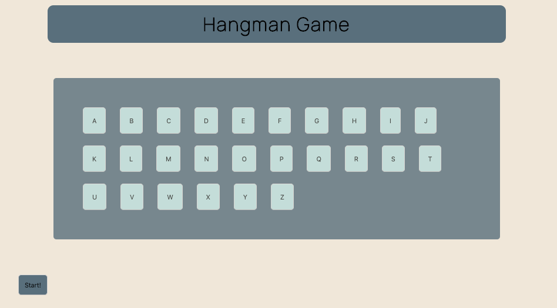

# Sameishly.github.io

# Hangman Game

A two player game application that allows player 1 to enter a random word that will be hidden and represented by slots for player 2 when the game begins. When player 2 correctly guesses a letter, the slots will be replaced with the correct letters chosen by player 2. Player 2 wins when all letters of the random word are guessed.

## Features

Players can input any random word.

Players key input is evaluated.

## Installation Instructions

Fork and clone to your repository.

### Technologies Used

Vanilla Javascript
